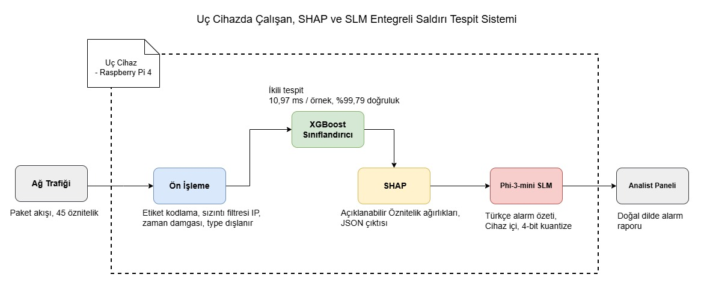

# Uç Cihazlarda Çalışan, SHAP Açıklanabilirlik ve SLM Entegreli Saldırı Tespit Sistemi

Bu proje, uç (edge) veya sis (fog) bilişim ağlarındaki (Örn: IoT ortamları, Raspberry Pi istasyonları vb.) tehditleri anlık olarak algılayabilmek amacıyla, bulut bağımlılığı olmayan on-device (cihaz-üstü) bir Siber Saldırı Tespit Sistemi (IDS) prototipidir. 

Sistem temel mimarisi: Siber saldırı sınıflandırmada yüksek başarıya sahip **XGBoost** algoritmasından, kararların şeffaf izlenebilirliği için oyun teorisine dayanan **SHAP (SHapley Additive exPlanations)** mimarisinden ve analiste teknik verileri doğal dilde açıklayabilen Küçük Dil Modeli (**SLM**, Phi-3-mini) entegrasyonundan oluşmaktadır.

---

## 🏗️ Sistem Mimarisi (Turkish)

Geliştirilen siber saldırı tespit sisteminin canlı test (Proof of Concept) süreçlerinin doğrulanması amacıyla sanal ve fiziksel bileşenlerin entegre edildiği hibrit bir test yatağı (testbed) ortamı kurulmuştur. Sistem bileşenlerinin topolojik dağılımı şu şekildedir:

* **Simülasyon ve Konak Donanım Altyapısı:** Ana konak (Host) bilgisayar olarak Windows 11 (16 GB RAM, NVIDIA GTX 1650) donanımı kullanılmış ve tip hypervisor olarak **VMware Workstation Pro 26H1** sanallaştırma katmanı konumlandırılmıştır.
* **Sanal Düğümler (Sanal Sunucular):** İzole simülasyon ortamında iki adet **Ubuntu Server 26.04 LTS** işletim sistemi ayağa kaldırılmıştır:
  * `SimVM-Normal`: Ağ üzerinde olağan trafik üretimi sağlamak amacıyla bünyesinde HTTP ve FTP gibi temel ağ servislerini barındıran kurban/hedef makine.
  * `SimVM-Attacker`: Hedef makineye siber saldırı vektörleri fırlatmakla görevli saldırgan makine.
* **Ağ Konfigürasyonu:** Sanal makinelerin ağ adaptörleri fiziksel ağ durumunu kopyalayacak şekilde **"Bridged Mode (with replicated physical network connection state)"** olarak yapılandırılmıştır. Düğümler dinamik olarak `192.168.137.X` DHCP alt ağ aralığından IP adresi almaktadır.
* **Donanım Entegrasyonu ve Canlı Çıkarım (Inference):** Saldırgan (`SimVM-Attacker`) ile hedef (`SimVM-Normal`) makineler arasındaki ağ hattına RJ45 Ethernet arayüzü üzerinden satır içi (**inline**) olarak fiziksel bir **Raspberry Pi 4 (8GB)** donanımı entegre edilmiştir. Bu uç cihaz üzerinde, Google Colab (T4 GPU) ortamında **CICIoT2023** veri setiyle eğitilmiş ve optimize edilmiş hafifletilmiş makine öğrenmesi modeli canlı ağ paketlerini dinleyerek anlık anomali tespiti gerçekleştirmektedir.
* **Merkezi Bildirim ve Bulut Dağıtımı:** Raspberry Pi 4 donanımı hat üzerinde herhangi bir anomali veya saldırı izi yakaladığı anda, yerel kaynakları yormamak adına veriyi harici bir **HTTP POST** webhook isteği (JSON payload) ile bulut tabanlı **Render** platformunda barındırılan web backend sunucusuna iletir ve geliştirilen gösterge panelinde (UI) gerçek zamanlı olarak görselleştirir.

---

## 🏗️ System Architecture (English)

To validate the real-time detection capabilities of the proposed intrusion detection system, a hybrid testbed combining virtual and physical network components has been implemented. The architectural layout consists of the following components:

* **Simulation & Host Infrastructure:** The core framework is deployed on a Windows 11 host (16 GB RAM, NVIDIA GTX 1650) utilizing **VMware Workstation Pro 26H1** as the primary type-2 hypervisor layer.
* **Virtual Nodes (Target & Attacker):** Two distinct **Ubuntu Server 26.04 LTS** virtual instances are configured within the isolated sandbox environment:
  * `SimVM-Normal`: The victim/target node running essential network services such as HTTP and FTP to generate baseline operational traffic.
  * `SimVM-Attacker`: The dedicated malicious node utilized to execute simulated cyber attack vectors against the target server.
* **Networking Environment:** The virtual network adapters are configured in **"Bridged Mode (with replicated physical network connection state)"** to seamlessly map onto the physical layer. The servers dynamically lease IP addresses within the `192.168.137.X` DHCP subnet range.
* **Hardware Integration & Inline Inference:** A physical **Raspberry Pi 4 (8GB)** hardware appliance is integrated **inline** between the attacker and target network streams via an RJ45 Ethernet interface. This edge device runs the lightweight anomaly detection model—previously trained on Google Colab (T4 GPU) using the **CICIoT2023** dataset—to perform real-time packet sniffing and zero-latency stream classification.
* **Central Alerting & Cloud Deployment:** Upon detecting an anomaly or exploit pattern, the Raspberry Pi 4 issues an asynchronous **HTTP POST** webhook request containing the transaction payload to a centralized web backend deployed on the **Render** cloud platform, reflecting the threat mitigation metrics onto a web user interface.

---

## 🏗️ Proje İş Paketleri (Project Work Packages)

Önerilen projenin yöntem mimarisi; “Veri Ön İşleme”, “XGBoost Model Eğitimi”, “SHAP Entegrasyonu ve Testleri”, “Yerel SLM Entegrasyonu” ve “Canlı Sistem Testleri ve Final Sürecine Hazırlık” olmak üzere beş iş paketinden oluşmaktadır. İlk 4 iş paketi, Şekil 1’de diyagrama karşılık gelmektedir. 5. iş paketi ise, bu mimarinin gerçek donanım kaynaklarına taşınması ve ürünleşmesi sürecini kapsamaktadır.

## 🌟 Temel Özellikler (Features)

* **Edge Cihaz Optimizasyonu:** Kurulan ML iterasyonu <5 MB seviyesinde sıkıştırılmıştır ve gelen sistem/ağ telemetrilerini cihaz üzerinde cihaz başı 10 ms (milisaniye) hızlarda derecelendirir.
* **Yüksek Doğruluk Oranı:** Modern IoT tehditlerini barındıran veri tabanlarında, zafiyet/alarm kaçırma senaryolarını önlemek amacıyla **%98+ Doğruluk (Accuracy)** ve **%99+ Duyarlılık (Recall)** gibi oldukça başarılı oranlara imza atmıştır.
* **Şeffaf Tehdit Teşhisi (Kara Kutu Çözümü):** Ağ saldırı uyarılarını "var" ya da "yok" şeklinde vermez. İçerdiriği SHAP Katmanı ile birlikte tahmini tetikleyen "Nedenleri" bulur ve "Örneğin: Bu saldırı, Port 4444 tabanlı bir ters bağlantıdır" şeklinde nedensel ağırlıkları ekrana basar.
* **Dil Modeli Destekli Uyarı Sistemi (Natural Language Alerts):** Modülden dönen yoğun matematiksel SHAP sayılarını; Olay Müdahale Uzmanlarının (SOC/Incident Response) anlayıp anında aksiyon komutları (Playbook) yazabileceği özet doğal insan diline çevirir.

## 🚀 Öne Çıkan Başarımlar (Key Highlights)

* **Veri Egemenliği/Gizliliği:** Güvenlik tespitleri esnasında buluta bağımlı kalınmaz, lokal çalışır. Veri sızıntısının önüne geçer.
* **Alarm Yorgunluğu Çözümlemesi:** Yanlış alarmların (False Positive) sayısını minimize edecek stabil eğrilere (PR, ROC-AUC) sahiptir.
* **Kesintisiz Veri Akışı (Data Pipeline):** IP tabanlı "ezbercilikleri" ve hedef bağımlılıklarını önleyen baştan aşağı izole edilmiş Veri Sızıntısı (Data Leakage) önleyici bir veri ön işleme filtresine sahiptir.
* Model port-bazlı bilindik Metasploit tarzı zararlı davranış modellerini tanır ve yakalar.

## ⚙️ Nasıl Çalıştırılır? (How to Run)

Projenin defter yapısı bir Google Colab (Jupyter) ortamında anında baştan aşağı koşacak şekilde tasarlanmıştır:

1. Bir **Google Colab** oturumu başlatın. 
2. `hids.ipynb` defterini (script'ini) çalışma diskinize bağlayın/aktarın.
3. Çalışma süresince gerekli veri setlerini indirme işlemi Kaggle Hub vasıtasıyla kendi kendine yapılacaktır.
4. Menü sekmelerinden `Runtime -> Run all` (Çalışma Zamanı -> Tümünü Çalıştır) butonuna basın. (İlk çalıştırmada ortalama döngü 2-3 dakika sürebilir).
5. *(İsteğe Bağlı)* Defterin sonundaki doğal dil modelinin (Phi-3-mini) mock testten gerçeğine (canlı inference) geçişini sağlamak için **Colab T4 GPU** desteği sekmesini aktif edin ve hücre başındaki yorum satırlarını (slash-out) kaldırın.