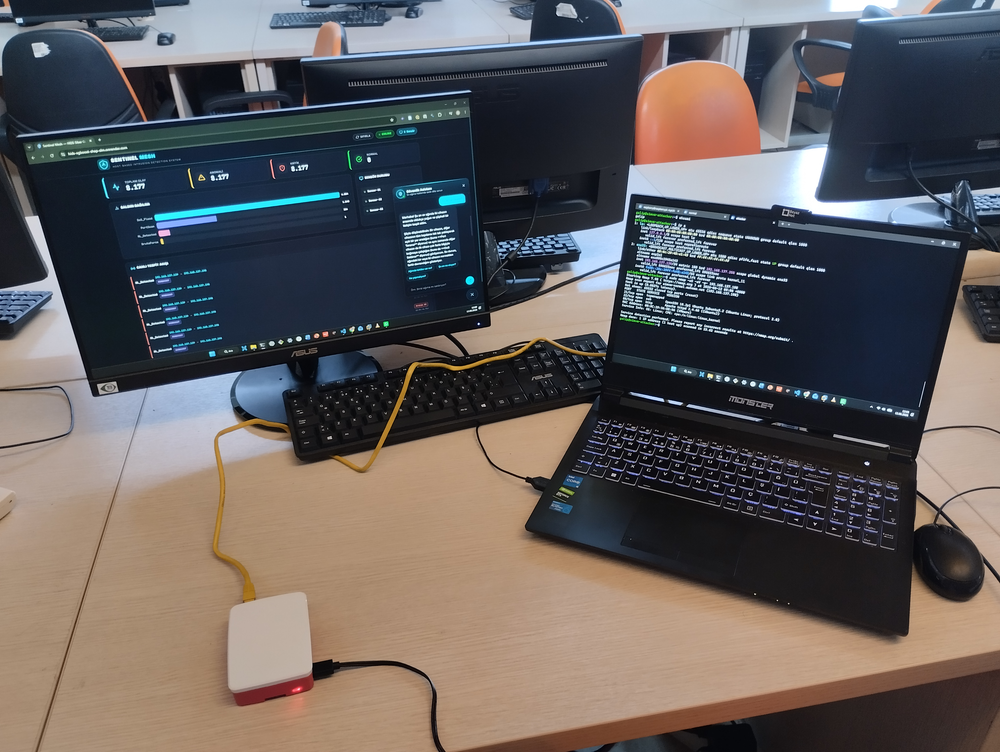

<h1 align="center">🛡️ Edge HIDS — Explainable Intrusion Detection on Raspberry Pi</h1>
<p align="center">
  <b>Raspberry Pi üzerinde, XGBoost + SHAP açıklanabilirliği ve sade-dil chatbot ile saldırı tespit sistemi</b><br/>
  <i>An explainable, edge-deployed Host-based Intrusion Detection System (HIDS) for non-technical end-users</i>
</p>

<p align="center">
  
  
  
  
  
  
  
</p>

<p align="center">
  🌐 <b>Canlı Dashboard / Live Dashboard:</b> <a href="https://hids-xgboost-shap-slm.onrender.com">hids-xgboost-shap-slm.onrender.com</a><br/>
  <sub>(Gerçek sensör bağlı değilken örnek/DEMO veri gösterir · shows sample/DEMO data when no sensor is connected)</sub>
</p>

<p align="center"><b><a href="#-türkçe">🇹🇷 Türkçe</a> &nbsp;|&nbsp; <a href="#-english">🇬🇧 English</a></b></p>



> **Author / Yazar:** Galip Talha ERBAŞ · **Mentor / Danışman:** Dr. Enis KARAARSLAN
> · Muğla Sıtkı Koçman Üniversitesi, Bilgisayar Mühendisliği · BSc Thesis / Lisans Bitirme Projesi

---

# 🇹🇷 Türkçe

## 📌 Genel Bakış
Bu proje, ev/IoT ağlarındaki tehditleri **uç cihaz (Raspberry Pi 4) üzerinde, yerel olarak** algılayan açıklanabilir bir Host-Tabanlı Saldırı Tespit Sistemi (HIDS) prototipidir. Kurumsal IDS çözümlerinin gücünü, **teknik bilgisi olmayan ev kullanıcısının** ethernet'e takıp anlayabileceği bir cihaza indirger.

- **Tespit** uç cihazda lokal çalışır (XGBoost + kural tabanlı).
- **Açıklanabilirlik** her tespitte canlı **SHAP** ile sağlanır (hangi öznitelik kararı ne kadar etkiledi).
- **Sade-dil chatbot** ağ olaylarını teknik olmayan kullanıcıya anlatır (bulut Google Gemini API).
- **Mobil bildirim** kritik saldırıda anında Telegram'a düşer.

> **Akademik dürüstlük notu:** Cihaz-üstü çalışan kısım tespit motorudur. Chatbot ve doğal-dil açıklamaları **bulut** servisine (Gemini) istek atar; sistem tümüyle buluttan bağımsız değildir. Cihaz-içi bir Küçük Dil Modeli (SLM) bu sürümde **yoktur** — gelecek çalışmadır (repo adındaki "SLM" başlangıçtaki kapsamdan gelir).

## 🏗️ Mimari
```
[Saldırgan VM] ─┐  (Pi, ARP-MITM ile araya inline girer)
                ├─► [Raspberry Pi 4: Sniffer → Kural + XGBoost + canlı SHAP]
[Kurban VM]   ─┘                 │  └─ logs/detections.jsonl (kalıcı, MITRE etiketli)
                                 ▼
                       [Bulut Relay (Render, FastAPI/WebSocket)]
                                 │
              ┌──────────────────┼───────────────────────┐
              ▼                  ▼                         ▼
     [Web Dashboard]      [Telegram bildirimi]    [Gemini chatbot]
   canlı akış + KPI +      kritik saldırıda         sade-dil soru/cevap
   olay-detay + SHAP        anlık mobil push
```
**Testbed:** Windows 11 host + VMware Workstation Pro · 2× Ubuntu Server VM (saldırgan + kurban, bridged) · model eğitimi Google Colab (T4 GPU) · canlı çıkarım Raspberry Pi 4 (8GB, CPU).

## 🌟 Özellikler
- **Edge ML:** CICIoT2023 ile eğitilmiş XGBoost; Pi'de ölçülen çıkarım **~2.6–6.1 ms/akış** (ort. ~3.4 ms), model dosyası **~0.4 MB**.
- **Hibrit tespit:** Anlık kural katmanı (port tarama, SYN/UDP/ICMP flood, brute-force) + akış-bazlı XGBoost (3 sn pencere).
- **Canlı açıklanabilirlik (SHAP):** Her XGBoost tespitinde, XGBoost'un yerel `pred_contribs` (TreeSHAP) özelliğiyle kararı en çok etkileyen öznitelikler hesaplanır — ek `shap` kütüphanesi gerektirmez, **Pi-dostu**. Dashboard'da "Neden?" satırı ve detay panelinde bar grafiği olarak gösterilir.
- **MITRE ATT&CK eşlemesi:** Her tespit ilgili teknik ile etiketlenir (T1046, T1498, T1110, T1499, T1190).
- **Web dashboard:** Gerçek zamanlı (WebSocket) akış, KPI'lar, saldırı dağılımı, DEMO/CANLI rozeti, **olay-detay paneli** (SHAP barları + MITRE + önerilen müdahale), Gemini chatbot.
- **Mobil bildirim:** Kritik saldırıda Telegram'a anlık push (flood-spam'i önleyen cooldown ile).
- **Bilimsel değerlendirme:** `experiments/` ground-truth üreteci (`attack-runner.sh`) + zaman-pencereli eşleştirme defteri (`evaluate_live.ipynb`) → gerçek recall / false-positive / Pi gecikmesi.

## 📊 Sonuçlar
| Metrik | Değer | Kaynak |
|--------|-------|--------|
| Doğruluk (Accuracy) | **%99.64** | CICIoT2023 test kümesi |
| F1 | **0.998** | CICIoT2023 test kümesi |
| AUC-ROC | **0.9996** | CICIoT2023 test kümesi |
| Öznitelik sayısı | **40** (canlı hesaplanabilir alt küme) | train/serve parite |
| Pi çıkarım gecikmesi | **~3.4 ms/akış** | gerçek donanım ölçümü |

> Benchmark metrikleri veri setinin **test kümesine** aittir. Canlı testbed başarımı (`experiments/`) ayrıca, ground-truth ile eşleştirilerek ölçülür.

## ⚙️ Nasıl Çalıştırılır?
1. **Model eğitimi (Colab):** `colab/CICIoT2023_XGBoost_Training.ipynb` → Runtime ▸ Run all. Çıktılar (`xgboost_ciciot2023.joblib`, `scaler.joblib`, `feature_names.json`, `model_meta.json`) `models/` altına gelir.
2. **Pi'ye dağıt:** `bash hids-sensor/deploy-to-pi.sh <PI_IP> <KULLANICI>` (kod + model + scriptler).
3. **Sensörü inline başlat:** Pi'de `sudo bash /opt/hids-sensor/mitm-run.sh <KURBAN_IP> <SALDIRGAN_IP>`.
4. **Dashboard:** Canlı panel için Render servisi (yukarıdaki link) veya yerel relay.
5. **Değerlendirme:** Saldırgan VM'de `experiments2/attack-runner.sh` → `evaluate_live.ipynb`. Ayrıntı: [`docs/DEMO-GUIDE.md`](docs/DEMO-GUIDE.md).

## ⚠️ Sınırlar & Gelecek Çalışma
- **Simülasyon testbed'i:** Kontrollü VM ortamı; büyük ölçekli gerçek trafik değil.
- **Bulut chatbot:** Doğal-dil katmanı Gemini'ye bağlıdır; cihaz-içi SLM gelecek çalışmadır.
- **Kural katmanı yön/etiket gürültüsü:** Yüksek hızlı flood'da kurban cevapları kuralı yanıltabilir (backscatter); akış-bazlı XGBoost daha sağlamdır.
- **İkili sınıflandırma:** Saldırı/normal; çok-sınıf (saldırı türü) sınıflandırma gelecek çalışmadır.
- **Inline ARP-MITM** testbed konumlandırması içindir; üretimde pasif TAP/SPAN veya gerçek köprü tercih edilmelidir.

---

# 🇬🇧 English

## 📌 Overview
This project is an **explainable, edge-deployed Host-based Intrusion Detection System (HIDS)** that detects threats in home/IoT networks **locally on a Raspberry Pi 4**. It brings enterprise-grade detection down to a device a **non-technical end-user** can plug into their ethernet and understand.

- **Detection** runs locally on the edge device (XGBoost + rule-based).
- **Explainability** is provided per detection via live **SHAP** (which feature drove the decision, and how much).
- A **plain-language chatbot** explains network events to non-technical users (cloud Google Gemini API).
- **Mobile alerts** are pushed instantly to Telegram on critical attacks.

> **Academic-honesty note:** The on-device part is the detection engine. The chatbot and natural-language explanations call a **cloud** service (Gemini); the system is not fully cloud-independent. There is **no** on-device Small Language Model (SLM) in this version — it is positioned as future work (the "SLM" in the repo name reflects the original scope).

## 🏗️ Architecture
```
[Attacker VM] ─┐  (Pi sits inline via ARP-MITM)
               ├─► [Raspberry Pi 4: Sniffer → Rules + XGBoost + live SHAP]
[Victim VM]  ─┘                  │  └─ logs/detections.jsonl (persistent, MITRE-tagged)
                                 ▼
                       [Cloud Relay (Render, FastAPI/WebSocket)]
                                 │
              ┌──────────────────┼───────────────────────┐
              ▼                  ▼                         ▼
       [Web Dashboard]     [Telegram alert]         [Gemini chatbot]
   live feed + KPIs +     instant mobile push       plain-language Q&A
   event detail + SHAP     on critical attacks
```
**Testbed:** Windows 11 host + VMware Workstation Pro · 2× Ubuntu Server VMs (attacker + victim, bridged) · model trained on Google Colab (T4 GPU) · live inference on Raspberry Pi 4 (8GB, CPU).

## 🌟 Features
- **Edge ML:** XGBoost trained on CICIoT2023; measured inference on the Pi **~2.6–6.1 ms/flow** (avg ~3.4 ms), model file **~0.4 MB**.
- **Hybrid detection:** Instant rule layer (port scan, SYN/UDP/ICMP flood, brute-force) + flow-based XGBoost (3 s window).
- **Live explainability (SHAP):** For every XGBoost detection, top contributing features are computed via XGBoost's native `pred_contribs` (TreeSHAP) — **no heavy `shap` dependency, Pi-friendly**. Shown as a "Why?" line and bar chart in the event-detail panel.
- **MITRE ATT&CK mapping:** Each detection is tagged with its technique (T1046, T1498, T1110, T1499, T1190).
- **Web dashboard:** Real-time (WebSocket) feed, KPIs, attack distribution, DEMO/LIVE badge, **event-detail modal** (SHAP bars + MITRE + recommended actions), Gemini chatbot.
- **Mobile alerts:** Instant Telegram push on critical attacks (with cooldown to avoid flood spam).
- **Scientific evaluation:** `experiments/` ground-truth generator (`attack-runner.sh`) + time-window matching notebook (`evaluate_live.ipynb`) → real recall / false-positive / Pi latency.

## 📊 Results
| Metric | Value | Source |
|--------|-------|--------|
| Accuracy | **99.64%** | CICIoT2023 test set |
| F1 | **0.998** | CICIoT2023 test set |
| AUC-ROC | **0.9996** | CICIoT2023 test set |
| Feature count | **40** (live-computable subset) | train/serve parity |
| Pi inference latency | **~3.4 ms/flow** | real hardware measurement |

> Benchmark metrics are on the dataset's **test set**. Live-testbed performance is measured separately in `experiments/` by matching detections against ground truth.

## ⚙️ How to Run
1. **Train (Colab):** `colab/CICIoT2023_XGBoost_Training.ipynb` → Runtime ▸ Run all. Artifacts (`xgboost_ciciot2023.joblib`, `scaler.joblib`, `feature_names.json`, `model_meta.json`) land in `models/`.
2. **Deploy to Pi:** `bash hids-sensor/deploy-to-pi.sh <PI_IP> <USER>` (code + model + scripts).
3. **Start the sensor inline:** on the Pi, `sudo bash /opt/hids-sensor/mitm-run.sh <VICTIM_IP> <ATTACKER_IP>`.
4. **Dashboard:** the Render service (link above) or a local relay.
5. **Evaluate:** on the attacker VM run `experiments2/attack-runner.sh`, then `evaluate_live.ipynb`. Details: [`docs/DEMO-GUIDE.md`](docs/DEMO-GUIDE.md).

## ⚠️ Limitations & Future Work
- **Simulation testbed:** controlled VM environment, not large-scale real traffic.
- **Cloud chatbot:** the NL layer depends on Gemini; an on-device SLM is future work.
- **Rule-layer direction/label noise:** under high-rate floods, victim responses can mislead rules (backscatter); flow-based XGBoost is more robust.
- **Binary classification:** attack/normal; multi-class (attack family) is future work.
- **Inline ARP-MITM** is for the testbed; production should use a passive TAP/SPAN or a true bridge.

---

## 📁 Repo Yapısı / Structure
```
hids-sensor/      Raspberry Pi sensörü (sniffer, flow agg., detector, app) + deploy/run scriptleri
sentinel-mesh/    Bulut relay (FastAPI) + web dashboard (static) + Flutter mobil app iskeleti
colab/            CICIoT2023 XGBoost eğitim defteri
models/           Eğitilmiş model + scaler + feature_names + meta
experiments/ , experiments2/   Ground-truth üreteci + canlı değerlendirme defteri
docs/             Kurulum, ilerleme, risk ve DEMO rehberi
project/          Fonksiyonel gereksinimler + araç/sürüm dökümü (toolkit.json)
```

## 📜 Lisans / License
Bkz. / See [`LICENSE`](LICENSE).
